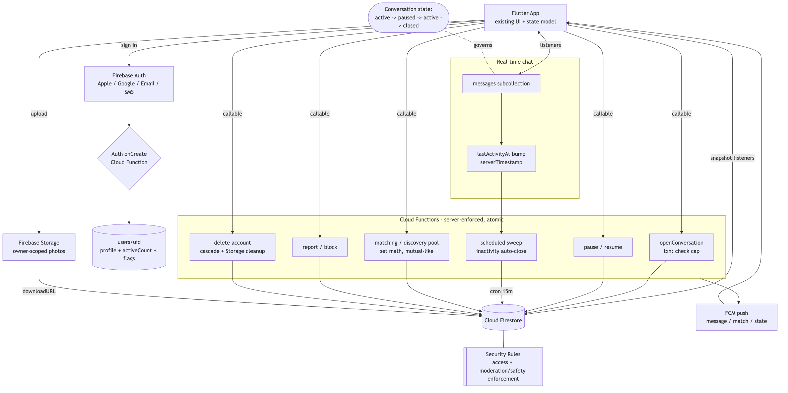

# Firebase Backend Architecture - Real-time Dating App (Flutter)

Server-enforced backend design for a Flutter dating app: Cloud Firestore + Security Rules, Auth (Apple/Google/Email/SMS), Cloud Functions, Storage, FCM. Every product rule (active-conversation cap, conversation state machine, inactivity auto-close, matching pool, block/report, account deletion) is enforced server-side - the client cannot bypass it.

## Architecture flowchart

## Core principle

Counts and timers are server-owned, mutated only inside atomic Firestore transactions / batched writes. The client reads, never computes. This kills lost-update races on the conversation cap and prevents client-faked state.

## How each rule is enforced

- **Active-conversation cap** - `openConversation` Callable runs a Firestore transaction: reads `activeCount` on both users, rejects at cap, creates the conversation, increments both counters atomically. Security Rules forbid clients creating conversations directly.
- **Conversation state machine** (`active -> paused -> active -> closed`) - pause/resume via Callable; the client only reads state.
- **Inactivity auto-close** - a scheduled Cloud Function sweeps conversations whose `lastActivityAt` (serverTimestamp) is older than the window and moves them to `closed`, decrementing `activeCount`.
- **Matching / discovery pool** - Function computes eligible candidates (set difference: minus blocked, blocked-by, already-matched, self, optionally over-cap). Mutual-like creates match + conversation in one transaction.
- **Block / report** - Callable writes `blocks` + `reports`; Rules hide blocked users both ways and gate message writes; reports land in a moderation queue.
- **Account deletion** - Function cascades: profile + pools + conversations + Storage objects, revokes sessions (App Store compliant).
- **Real-time chat** - Firestore snapshot listeners on the `messages` subcollection; each send bumps `lastActivityAt`.
- **Photos** - Firebase Storage, owner-scoped Rules; client already routes storage URLs.
- **Push** - FCM on new message / match / state change.
